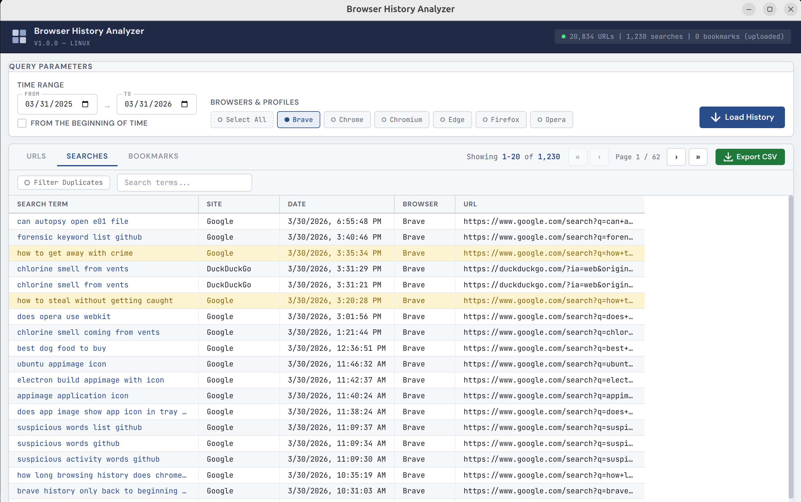
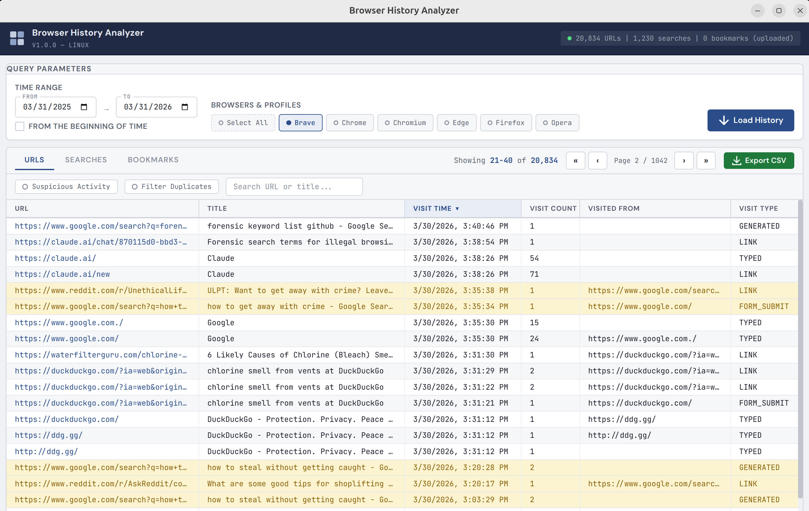

# Browser History Analyzer

A Linux and Windows desktop application for parsing, analyzing, and exporting web browser history, search queries, and bookmarks from Chromium-based browsers. Built with Electron and Node.js. Distributed as a portable AppImage (Linux) or portable EXE (Windows) — no installation required. Inspired by BrowserHistoryView the utility by Nirsoft.

> **Disclaimer:** This tool is intended for forensic, investigative, or educational purposes only. Use responsibly and in accordance with applicable laws and policies.





## Features

- **Multi-browser support** — Brave, Google Chrome, Chromium, Microsoft Edge, and Opera with automatic profile discovery
- **Three analysis views** — URLs (full history), Searches (extracted search queries), and Bookmarks
- **Suspicious activity detection** — Flags URLs/titles matching profanity, data exfiltration tools, hacking resources, anonymization services, insider threat indicators, and 90+ forensic keywords
- **Search extraction** — Pulls search terms from the browser's `keyword_search_terms` database table and detects searches from URL patterns (Google, Bing, DuckDuckGo, Yahoo, Brave Search, YouTube, Amazon, Reddit, Baidu, Yandex)
- **Bookmark parsing** — Reads Chromium Bookmarks JSON files with full folder path breadcrumbs
- **Duplicate filtering** — Groups visits by URL, sums durations, shows first/last visit times
- **Date range filtering** — Custom date picker with "from the beginning of time" option
- **Column sorting** — Click any column header to sort ascending/descending
- **Pagination** — 15 records per page with navigation controls
- **CSV export** — Export any tab's data to CSV with proper RFC 4180 escaping
- **Text search** — Real-time filtering across URL and title fields

## Supported Browsers

The app automatically scans for browser profiles in these locations:

#### Linux

| Browser   | Native (apt/deb)                                    | Flatpak                                                              | Snap                                                              |
|-----------|-----------------------------------------------------|----------------------------------------------------------------------|-------------------------------------------------------------------|
| Brave     | `~/.config/BraveSoftware/Brave-Browser/`            | `~/.var/app/com.brave.Browser/config/BraveSoftware/Brave-Browser/`   | `~/snap/brave/current/.config/BraveSoftware/Brave-Browser/`       |
| Chrome    | `~/.config/google-chrome/`                          | `~/.var/app/com.google.Chrome/config/google-chrome/`                 | `~/snap/google-chrome/current/.config/google-chrome/`             |
| Chromium  | `~/.config/chromium/`                               | `~/.var/app/org.chromium.Chromium/config/chromium/`                  | `~/snap/chromium/current/.config/chromium/`                       |
| Edge      | `~/.config/microsoft-edge/`                         | `~/.var/app/com.microsoft.Edge/config/microsoft-edge/`               | `~/snap/microsoft-edge/current/.config/microsoft-edge/`           |

#### Windows

| Browser   | Path                                                                  |
|-----------|-----------------------------------------------------------------------|
| Brave     | `%LOCALAPPDATA%\BraveSoftware\Brave-Browser\User Data`               |
| Chrome    | `%LOCALAPPDATA%\Google\Chrome\User Data`                             |
| Chromium  | `%LOCALAPPDATA%\Chromium\User Data`                                  |
| Edge      | `%LOCALAPPDATA%\Microsoft\Edge\User Data`                            |
| Opera     | `%APPDATA%\Opera Software\Opera Stable`                              |

All profile directories (Default, Profile 1, Profile 2, etc.) are detected automatically.

## Download

The easiest way to get the application is to download a pre-built release:

- **Windows** — download the `.exe` portable executable
- **Linux** — download the `.AppImage` portable executable

No installation required for either platform — just download and run.

## Building from Source

### Prerequisites

- Node.js 18+ and npm
- Linux (tested on Ubuntu 24.04+) or Windows 10+

### Setup

```bash
git clone <repository-url>
cd browser-analysis
npm install
npx electron-rebuild
```

### Development

```bash
npm start
```

### Build AppImage (Linux)

```bash
npm run dist
```

The AppImage is output to `dist/Browser History Analyzer-1.0.0.AppImage`.

### Build Portable EXE (Windows)

From a Linux host (cross-compile):

```bash
npm run dist:win
```

This fetches the Windows `better-sqlite3` native binary, then builds a portable `.exe` via electron-builder. The EXE is output to the `dist/` directory.

### Using the Application

1. **Select a time range** — defaults to the past year, or check "From the beginning of time"
2. **Select browser profiles** — all detected profiles are shown, with a "Select All" option
3. **Click "Load History"** — loads URLs, searches, and bookmarks from all selected profiles
4. **Browse tabs**:
   - **URLs** — Full browsing history with visit counts, durations, referrers, and transition types
   - **Searches** — Extracted search queries with the search engine identified
   - **Bookmarks** — All bookmarks with folder paths
5. **Use filters** (URLs tab only):
   - **Suspicious Activity** — Show only flagged records (enabled after background analysis completes)
   - **Filter Duplicates** — Group by URL, sum durations, show first/last visit
   - **Search box** — Filter by URL or title text
6. **Export** — Click "Export CSV" to save the current tab's data

## Architecture

```
browser-analysis/
├── main.js                  # Electron main process, IPC handlers
├── preload.js               # Context bridge (secure API exposure)
├── src/
│   ├── db.js                # SQLite queries (history + search terms + profanity flagging)
│   ├── bookmarks.js         # Chromium Bookmarks JSON parser
│   ├── profiles.js          # Browser profile discovery (native/Flatpak/Snap)
│   ├── utils.js             # Chrome timestamp conversion, transition decoding, search URL parsing
│   └── csv-export.js        # RFC 4180 CSV generation
├── renderer/
│   ├── index.html           # Application shell with tab layout
│   ├── styles.css           # Light forensics theme
│   └── renderer.js          # UI logic, generic tab system, pagination, sorting, filters
├── build/
│   └── icons/               # App icons (16-256px) for electron-builder
├── AppIcon.png              # Application icon
└── package.json             # Dependencies and electron-builder config
```

### Data Flow

1. **Profile discovery** (`profiles.js`) — scans filesystem for browser data directories
2. **Database access** (`db.js`) — copies SQLite History file to temp (avoids browser lock), queries `visits` + `urls` tables, cleans up
3. **Search extraction** (`db.js` + `utils.js`) — queries `keyword_search_terms` table + parses search engine URLs from history
4. **Bookmark parsing** (`bookmarks.js`) — reads Chromium `Bookmarks` JSON, recursively flattens folder tree
5. **Profanity analysis** (`db.js`) — runs asynchronously after load, uses `bad-words` npm package + 90+ custom forensic keywords via compiled regex
6. **Rendering** (`renderer.js`) — generic tab system with independent sorting/pagination per tab

### IPC Channels

| Channel          | Direction       | Purpose                                              |
|------------------|-----------------|------------------------------------------------------|
| `get-profiles`   | renderer → main | Discover available browser profiles                  |
| `load-history`   | renderer → main | Query browsing history from SQLite                   |
| `load-searches`  | renderer → main | Extract search terms (DB + URL patterns)             |
| `load-bookmarks` | renderer → main | Parse bookmark JSON files                            |
| `flag-rows`      | renderer → main | Run profanity/suspicious content analysis            |
| `export-csv`     | renderer → main | Generate CSV file via save dialog                    |

## Technical Details

### Chrome Timestamps

Chromium-based browsers store timestamps as microseconds since January 1, 1601 (Windows NT epoch). Conversion to Unix epoch:

```
unix_seconds = (chrome_timestamp - 11644473600000000) / 1000000
```

### History Database Schema

The app queries two primary tables:

- **`urls`** — `id`, `url`, `title`, `visit_count`, `typed_count`, `last_visit_time`, `hidden`
- **`visits`** — `id`, `url` (FK to urls.id), `visit_time`, `from_visit`, `transition`, `visit_duration`
- **`keyword_search_terms`** — `keyword_id`, `url_id` (FK to urls.id), `term`, `normalized_term`

The `transition` field is a bitmask. Core types (lower 8 bits): LINK (0), TYPED (1), AUTO_BOOKMARK (2), AUTO_SUBFRAME (3), MANUAL_SUBFRAME (4), GENERATED (5), AUTO_TOPLEVEL (6), FORM_SUBMIT (7), RELOAD (8), KEYWORD (9), KEYWORD_GENERATED (10).

### Bookmarks JSON Format

Chromium stores bookmarks in a JSON file with this structure:

```json
{
  "roots": {
    "bookmark_bar": { "children": [...], "name": "Bookmarks bar" },
    "other": { "children": [...], "name": "Other bookmarks" },
    "synced": { "children": [...], "name": "Mobile bookmarks" }
  }
}
```

Each bookmark: `{ "name": "...", "url": "...", "type": "url", "date_added": "13411..." }`
Each folder: `{ "name": "...", "type": "folder", "children": [...] }`

### Suspicious Activity Detection

The app combines the `bad-words` npm package word list with 90+ custom forensic indicators across categories:

- Data exfiltration (pastebin, file sharing, anonymous uploads)
- Privacy/anonymization tools (Tor, VPNs, disposable email)
- Hacking tools and forums (exploit-db, metasploit, keyloggers)
- Credential theft (stealer, darkweb, bitcoin mixers)
- Social engineering (phishing, pretexting)
- Insider threat indicators (job searches, data theft, evidence destruction)
- Malware (ransomware, trojan, sandbox evasion)

Detection runs asynchronously after data loads so the UI remains responsive.

see SUSPICIOUS_ACTIVITY.md

### History Retention

Chromium-based browsers automatically purge history older than 90 days. This is a browser limitation, not a tool limitation.

## Dependencies

- **better-sqlite3** — Synchronous SQLite3 bindings for reading browser history databases
- **bad-words** — Profanity word list for suspicious content detection
- **electron** — Desktop application framework
- **electron-builder** — AppImage packaging

## License

MIT
